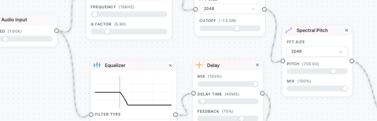

<div align="center">
  
  
  # Patchrome
<div align="center">
  
</div>


  **🎛️ どんなウェブサイトでもリアルタイムオーディオエフェクト**
  
  ブラウザを強力なオーディオプロセッサーに変えましょう。YouTubeビデオにリバーブを追加したり、ポッドキャストのピッチを変更したり、どんなウェブオーディオからも独自のサウンドスケープを作成できます。

  [](LICENSE)
</div>

## 🚀 クイックスタート

### GitHubリリースからインストール

1. [Releases](https://github.com/jumang4423/patchrome-ext/releases)から最新の`patchrome-v0.1.0.zip`をダウンロード
2. ファイルを解凍
3. Chromeを開いて`chrome://extensions/`にアクセス
4. 「デベロッパーモード」を有効化（右上）
5. 「パッケージ化されていない拡張機能を読み込む」をクリックして、解凍したフォルダを選択
6. ツールバーの拡張機能アイコンをクリックして開始！

### 使い方

1. **オーディオ/ビデオがあるウェブサイトを開く**（YouTube、SoundCloudなど）
2. **ツールバーのPatchromeアイコンをクリック**
3. **パネル内で右クリック**してエフェクトを追加
4. **アウトプットからインプットにドラッグ**してノードを接続
5. **スライダーでパラメータを調整**、ダブルクリックで精密な値を入力

## ✨ 機能

### 🎵 オーディオエフェクト
- **リバーブ** - 空間と雰囲気を追加
- **ディレイ** - エコーとリズミックパターンを作成  
- **ディストーション** - 暖かみとグリットを追加
- **EQ** - フィルターでサウンドを整形
- **フェイザー/フランジャー** - クラシックなモジュレーションエフェクト
- **ビットクラッシャー** - Lo-fiデジタルディストラクション
- **スペクトラルエフェクト** - 高度な周波数操作

### 🎛️ ビジュアルノードエディタ
- ドラッグ&ドロップインターフェース
- リアルタイムパラメータコントロール
- セッションごとにエフェクトチェーンを保存
- ビジュアルシグナルフロー

### ⚡ パフォーマンス
- 低レイテンシー処理
- 最小限のCPU使用率
- すべてのHTML5オーディオ/ビデオに対応

## 🌟 例

メニュー → プリセットを参照

## 🤝 貢献

貢献を歓迎します！お気軽に：
- バグを報告
- 新しいエフェクトを提案
- プルリクエストを送信
- エフェクトプリセットを共有

## 📝 開発

### ソースからビルド

```bash
# リポジトリをクローン
git clone https://github.com/jumang4423/patchrome-ext.git
cd patchrome-ext

# 依存関係をインストール
npm install

# 開発ビルド（ウォッチモード付き）
npm run dev

# プロダクションビルド
npm run build
```

### プロジェクト構造
```
patchrome-ext/
├── src/
│   ├── inject.js          # コアオーディオ処理
│   ├── sidepanel/         # React UI
│   ├── worklets/          # オーディオワークレットプロセッサ
│   └── types/             # TypeScript定義
├── manifest.json          # 拡張機能マニフェスト
└── webpack.config.js      # ビルド設定
```

### 新しいエフェクトの追加

詳細な手順については[ADD_EFFECT_INSTRUCTIONS.md](ADD_EFFECT_INSTRUCTIONS.md)を参照してください。

## 📄 ライセンス

MITライセンス - 自分のプロジェクトで自由に使用してください！

---